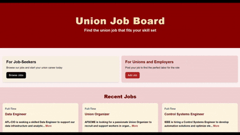

# Interactive Job Board

## Project Description
This small React web app is a prototype of an interactive union job board that allows users to view, create, edit, and delete job postings.



## Tools/Framework
- React
- Vite
- React Router

## Current Features
- View job postings
- Create new job postings
- Edit existing postings
- Delete job postings

## Installation
To run this project locally, ensure you have Node.js and npm installed. Then, follow these steps:

```bash
git clone https://github.com/neophyte577/jobs-board
cd <project-directory>
npm install
npm run dev